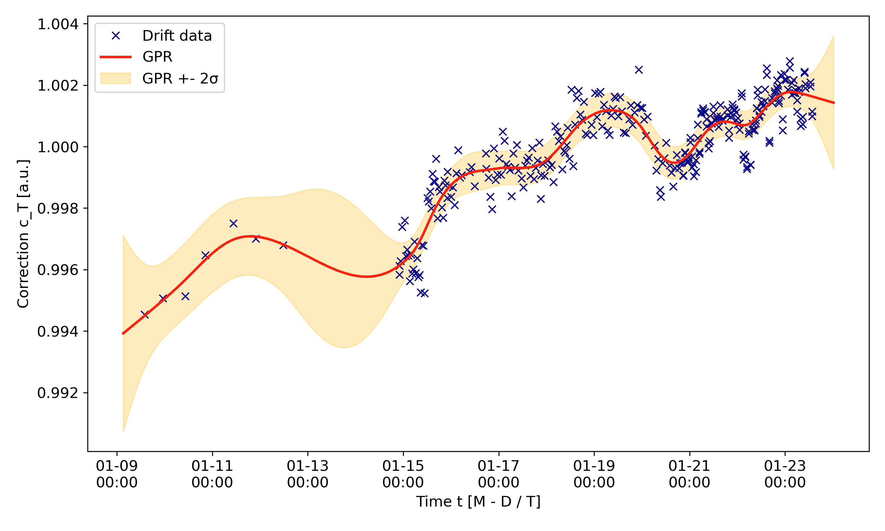
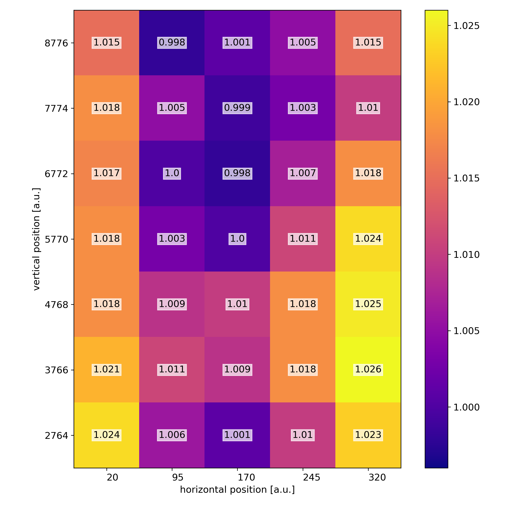
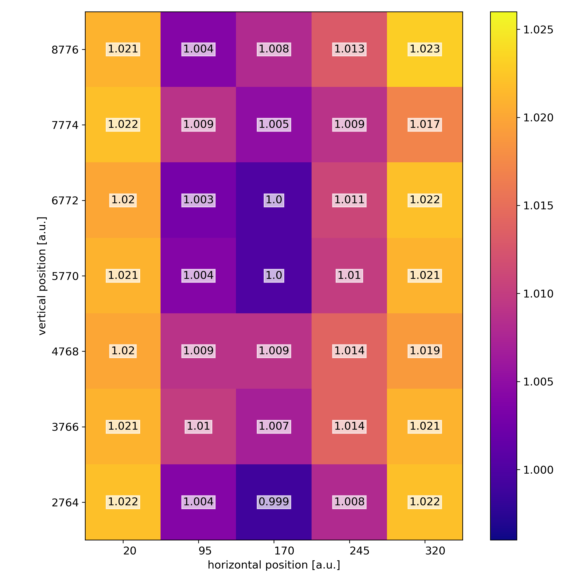

# detector-bayopt

Bayesian optimization for experimental design with Gaussian Processes used on the example case of detector response.
This repository is complementary material to the publication 
_"Gaussian Processes and Bayesian Optimization for High Precision Experiments"_
[[Lamparth et al.]](https://arxiv.org/abs/2205.07625).

The Gaussian process regression for the temperature correction of the detectors is 
available in the [panter](https://github.com/maxlampe/panter) analysis framework 
in the _panter.eval.evalDriftGPR.GPRDrift_ class.

This repository contains the code for the optimization of the spatial detector
response to go from the unoptimized, raw response map

to the optimized map using Gaussian process regression and Bayesian optimziation.

